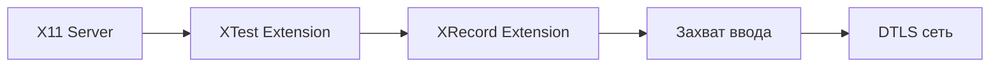
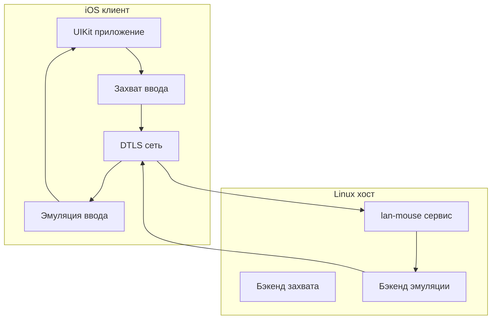
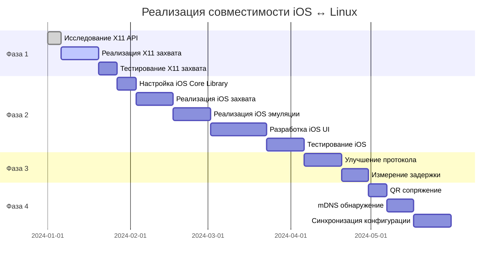

# Lan Mouse: Анализ совместимости iOS ↔ Linux (Wayland & X11)

## Краткое резюме

Lan Mouse — это кроссплатформенный программный KVM-переключатель, написанный на Rust, который позволяет использовать одну мышь и клавиатуру на нескольких устройствах. Этот анализ фокусируется на том, чтобы приложение работало безупречно между iOS и Linux (как на Wayland, так и на X11).

**Текущий статус:**
- ✅ macOS: Полная поддержка (захват + эмуляция)
- ✅ Linux Wayland: Хорошая поддержка через бэкенды libei и layer-shell
- ✅ Linux X11: Только эмуляция, захват НЕ реализован
- ❌ iOS: Существует только как сторонний proof-of-concept (не часть основного репозитория)

---

## Обзор архитектуры

### Структура проекта

```
lan-mouse/
├── input-capture/      # Библиотека захвата ввода для разных платформ
├── input-emulation/     # Библиотека эмуляции ввода для разных платформ
├── input-event/        # Определения типов событий и маппинг сканкодов
├── lan-mouse-ipc/      # IPC-коммуникация между сервисом и фронтендом
├── lan-mouse-cli/      # Интерфейс командной строки
├── lan-mouse-gtk/      # GTK4 + libadwaita фронтенд
├── lan-mouse-proto/    # Реализация сетевого протокола
└── src/                # Основная логика сервиса
```

### Основные компоненты

```mermaid
graph TB
    subgraph "Основной сервис"
        Service[Сервис]
        Capture[Захват]
        Emulation[Эмуляция]
        ClientManager[Менеджер клиентов]
        DnsResolver[DNS-резолвер]
    end
    
    subgraph "Бэкенды захвата ввода"
        LibeiCapture[libei - Wayland GNOME/KDE]
        LayerShell[layer-shell - wlroots композиторы]
        MacOSCapture[macOS - CGEventTap]
        WindowsCapture[Windows - Raw Input]
        X11Capture[X11 - НЕ РЕАЛИЗОВАН]
    end
    
    subgraph "Бэкенды эмуляции ввода"
        LibeiEmulation[libei - Wayland GNOME/KDE]
        WlrootsEmulation[wlroots - wlroots композиторы]
        XdpEmulation[xdg-desktop-portal - Wayland]
        X11Emulation[X11 - XTest]
        MacOSEmulation[macOS - CGEvent]
        WindowsEmulation[Windows - SendInput]
    end
    
    subgraph "Сетевой уровень"
        DTLS[DTLS шифрование]
        Proto[lan-mouse-proto]
    end
    
    Service --> Capture
    Service --> Emulation
    Service --> ClientManager
    Service --> DnsResolver
    
    Capture --> LibeiCapture
    Capture --> LayerShell
    Capture --> MacOSCapture
    Capture --> WindowsCapture
    Capture --> X11Capture
    
    Emulation --> LibeiEmulation
    Emulation --> WlrootsEmulation
    Emulation --> XdpEmulation
    Emulation --> X11Emulation
    Emulation --> MacOSEmulation
    Emulation --> WindowsEmulation
    
    Service --> DTLS
    Service --> Proto
```



---

## Ключевые аспекты текущей архитектуры

### 1. Модульная система бэкендов

Приложение использует архитектуру на основе трейтов для захвата и эмуляции:

**Трейт Capture** ([`input-capture/src/lib.rs`](../input-capture/src/lib.rs:266-279)):
```rust
#[async_trait]
trait Capture: Stream<Item = Result<(Position, CaptureEvent), CaptureError>> + Unpin {
    async fn create(&mut self, pos: Position) -> Result<(), CaptureError>;
    async fn destroy(&mut self, pos: Position) -> Result<(), CaptureError>;
    async fn release(&mut self) -> Result<(), CaptureError>;
    async fn terminate(&mut self) -> Result<(), CaptureError>;
}
```

**Трейт Emulation** ([`input-emulation/src/lib.rs`](../input-emulation/src/lib.rs:230-240)):
```rust
#[async_trait]
trait Emulation: Send {
    async fn consume(&mut self, event: Event, handle: EmulationHandle) -> Result<(), EmulationError>;
    async fn create(&mut self, handle: EmulationHandle);
    async fn destroy(&mut self, handle: EmulationHandle);
    async fn terminate(&mut self);
}
```

### 2. Сетевой протокол

Протокол ([`lan-mouse-proto/src/lib.rs`](../lan-mouse-proto/src/lib.rs)) использует:
- **DTLS шифрование** через WebRTC.rs для защищённой коммуникации
- **Бинарный протокол** с буферами фиксированного размера (MAX_EVENT_SIZE = 37 байт)
- **Типы событий**: PointerMotion, PointerButton, PointerAxis, KeyboardKey, KeyboardModifiers, Enter, Leave, Ack, Ping, Pong

### 3. Матрица поддержки платформ

| Платформа | Бэкенд захвата | Бэкенд эмуляции | Статус |
|----------|----------------|-------------------|--------|
| Linux Wayland (GNOME/KDE) | libei | libei, xdg-desktop-portal | ✅ Полный |
| Linux Wayland (wlroots) | layer-shell | wlroots | ✅ Полный |
| Linux X11 | ❌ НЕ РЕАЛИЗОВАН | X11 (XTest) | ⚠️ Только приём |
| macOS | CGEventTap | CGEvent | ✅ Полный |
| Windows | Raw Input | SendInput | ✅ Полный |
| iOS | ❌ Нет | ❌ Нет | ❌ Не поддерживается |

---

## Выявленные узкие места и проблемы

### Критические проблемы

#### 1. Захват ввода X11 не реализован
**Файл**: [`input-capture/src/x11.rs`](../input-capture/src/x11.rs)

Бэкенд захвата X11 возвращает ошибку `NotImplemented`:
```rust
pub fn new() -> std::result::Result<Self, X11InputCaptureCreationError> {
    Err(X11InputCaptureCreationError::NotImplemented)
}
```

**Влияние**: Пользователи Linux X11 могут только принимать события (эмуляция), но не отправлять их (захват).

#### 2. Нет официальной поддержки iOS
**Ссылка**: [README.md строки 53-56](../README.md:53-56)

Поддержка iOS существует только как сторонний proof-of-concept от rohitsangwan01:
```markdown
A proof of concept for an Android / IOS Application by [rohitsangwan01](https://github.com/rohitsangwan01/lan-mouse-mobile).
```

**Влияние**: Нет первоклассного iOS-клиента в основном репозитории.

### Умеренные проблемы

#### 3. Обработка модификаторных клавиш на wlroots
**Ссылка**: [README.md строки 42-43](../README.md:42-43)

```
Композиторы на базе wlroots без поддержки libei на принимающей стороне в данный момент не обрабатывают события модификаторов на стороне клиента.
Это приводит к тому, что клавиши CTRL / SHIFT / ALT / SUPER не работают с отправляющим устройством, которое НЕ использует бэкенд `layer-shell`
```

#### 4. Требование плагина для Wayfire
**Ссылка**: [README.md строки 45-46](../README.md:45-46)

Wayfire требует плагин `shortcuts-inhibit` для работы захвата ввода.

#### 5. Сложность перевода кодов клавиш
**Файлы**: 
- [`input-event/src/scancode.rs`](../input-event/src/scancode.rs) - маппинг сканкодов Linux
- [`input-capture/src/macos.rs`](../input-capture/src/macos.rs:197-202) - перевод кодов клавиш macOS

Кроссплатформенный перевод кодов клавиш сложен и подвержен ошибкам:
```rust
fn map_key(ev: &CGEvent) -> Result<u32, CaptureError> {
    let code = ev.get_integer_value_field(EventField::KEYBOARD_EVENT_KEYCODE);
    match KeyMap::from_key_mapping(KeyMapping::Mac(code as u16)) {
        Ok(k) => Ok(k.evdev as u32),
        Err(()) => Err(CaptureError::KeyMapError(code)),
    }
}
```

### Незначительные проблемы

#### 6. Эффективность сетевого протокола
- Буферы фиксированного размера (37 байт) могут тратить пропускную способность
- Нет сжатия или дельта-кодирования для событий движения курсора
- Измерение и визуализация задержки находятся в roadmap, но не реализованы

#### 7. Управление конфигурацией
- Конфигурация основана на файлах (TOML) с горячей перезагрузкой
- Нет распределённой синхронизации конфигурации между устройствами
- Требуется ручная авторизация по отпечатку

---

## План реализации для совместимости iOS ↔ Linux

### Фаза 1: Реализация захвата ввода X11 (Приоритет: ВЫСОКИЙ)

**Цель**: Включить пользователям Linux X11 отправлять события на другие устройства.

**Подход к реализации**:



**Ключевые компоненты**:

1. **Использование расширения XRecord** для захвата событий:
   - XRecord позволяет захватывать все события ввода глобально
   - Требует X11 сервер с поддержкой XRecord
   - Необходимо обрабатывать разрешения X11 (расширение XSecurity)

2. **Структура реализации**:
```rust
// input-capture/src/x11.rs
pub struct X11InputCapture {
    display: *mut xlib::Display,
    record_context: xrecord::XRecordContext,
    event_tx: Sender<(Position, CaptureEvent)>,
}

impl X11InputCapture {
    pub fn new() -> Result<Self, X11InputCaptureCreationError> {
        // Открыть дисплей
        // Инициализировать XRecord
        // Настроить маску событий
        // Начать запись
    }
}
```

3. **Обнаружение границ**:
   - Мониторинг позиции курсора с помощью `XQueryPointer`
   - Обнаружение границ экрана
   - Запуск захвата при пересечении курсором границы

**Файлы для модификации**:
- [`input-capture/src/x11.rs`](../input-capture/src/x11.rs) - Полная реализация
- [`input-capture/Cargo.toml`](../input-capture/Cargo.toml) - Добавление зависимости xrecord

**Зависимости**:
- Крейт `x11` с функцией `xrecord`
- X11 сервер с расширением XRecord

**Стратегия тестирования**:
- Юнит-тесты для обнаружения границ
- Интеграционные тесты с Xvfb (X Virtual Framebuffer)
- Ручное тестирование на реальных сессиях X11

---

### Фаза 2: Реализация iOS-клиента (Приоритет: ВЫСОКИЙ)

**Цель**: Создать первоклассный iOS-клиент, который может отправлять и принимать события.

**Решения по архитектуре**:



**Подход к реализации**:

#### Вариант A: Гибрид Swift/Rust (Рекомендуется)
- Использовать Rust для протокола и обработки событий (переиспользовать существующий код)
- Использовать Swift для UI и специфичных для iOS API
- Соединение через FFI (Foreign Function Interface)

**Структура проекта**:
```
lan-mouse-ios/
├── LanMouse/
│   ├── App/
│   │   ├── LanMouseApp.swift
│   │   └── ContentView.swift
│   ├── Core/
│   │   ├── lan_mouse_core.h
│   │   └── lan_mouse_core.xcodeproj
│   └── Resources/
└── lan_mouse_core/  # Rust библиотека
    ├── src/
    │   ├── lib.rs
    │   ├── ios_capture.rs
    │   ├── ios_emulation.rs
    │   └── protocol.rs
    └── Cargo.toml
```

**Ключевые компоненты**:

1. **Захват ввода iOS**:
```rust
// lan_mouse_core/src/ios_capture.rs
use core_graphics::event::CGEvent;
use core_foundation::runloop::CFRunLoop;

pub struct IOSInputCapture {
    event_tap: CGEventTap,
    event_tx: Sender<CaptureEvent>,
}
```

2. **Эмуляция ввода iOS**:
```rust
// lan_mouse_core/src/ios_emulation.rs
pub struct IOSEmulation {
    event_source: CGEventSource,
}
```

3. **Сетевой уровень**:
- Переиспользовать существующую реализацию DTLS из основного проекта
- Реализовать как статическую/разделяемую библиотеку для iOS

**Файлы для создания**:
- `lan-mouse-ios/` - Новый каталог проекта iOS
- `lan-mouse-ios/lan_mouse_core/` - Rust основная библиотека
- `lan-mouse-ios/LanMouse/` - Swift UI приложение

**Зависимости**:
- Крейты Rust `cocoa` и `core-graphics`
- Swift `CryptoKit` для DTLS (или использовать Rust-реализацию)
- Swift фреймворк `Network`

**Стратегия тестирования**:
- Тестирование в iOS Simulator
- Тестирование на физическом устройстве (требует сертификат разработчика)
- Интеграционное тестирование с Linux хостом

---

### Фаза 3: Улучшенный протокол и производительность (Приоритет: СРЕДНИЙ)

**Цель**: Улучшить эффективность протокола и добавить измерение задержки.

**Улучшения**:

1. **Кодирование переменной длины**:
   - Использовать Protocol Buffers или MessagePack для более эффективного кодирования
   - Снизить использование пропускной способности для событий движения указателя

2. **Дельта-кодирование для движения**:
   - Отправлять только изменения позиции
   - Реализовать алгоритмы предсказания

3. **Измерение задержки**:
   - Добавить временную метку к событиям
   - Рассчитывать время полного цикла (round-trip time)
   - Отображать задержку в UI

**Файлы для модификации**:
- [`lan-mouse-proto/src/lib.rs`](../lan-mouse-proto/src/lib.rs) - Улучшения протокола
- [`src/service.rs`](../src/service.rs) - Отслеживание задержки

---

### Фаза 4: Улучшенная конфигурация и UX (Приоритет: НИЗКИЙ)

**Цель**: Улучшить пользовательский опыт для межустройственной конфигурации.

**Улучшения**:

1. **Сопряжение по QR-коду**:
   - Генерировать QR-код с информацией о подключении
   - Сканировать камерой iOS для лёгкого сопряжения

2. **Автообнаружение**:
   - mDNS/Bonjour для обнаружения устройств
   - Настройка без конфигурации

3. **Синхронизация конфигурации**:
   - Делиться конфигурациями клиентов между устройствами
   - Опция облачной синхронизации

**Файлы для создания**:
- `src/discovery.rs` - mDNS обнаружение
- `lan-mouse-gtk/src/qr_pairing.rs` - Генерация QR-кода

---

## Детальная дорожная карта реализации

### Разбивка на задачи



### Детальный список задач

#### Фаза 1: Захват ввода X11

| Задача | Описание | Зависимости | Сложность |
|------|-------------|--------------|-----------|
| 1.1 | Исследование API XRecord | Нет | Низкая |
| 1.2 | Добавление зависимости xrecord в Cargo.toml | Нет | Низкая |
| 1.3 | Реализация инициализации контекста XRecord | 1.1, 1.2 | Средняя |
| 1.4 | Реализация колбэка событий для XRecord | 1.3 | Средняя |
| 1.5 | Реализация логики обнаружения границ | 1.4 | Высокая |
| 1.6 | Реализация перевода кодов клавиш (X11 → Linux) | 1.4 | Средняя |
| 1.7 | Добавление обработки ошибок для разрешений X11 | 1.3 | Средняя |
| 1.8 | Написание юнит-тестов | 1.5, 1.6 | Средняя |
| 1.9 | Интеграционное тестирование с Xvfb | 1.8 | Высокая |
| 1.10 | Ручное тестирование на реальных сессиях X11 | 1.9 | Средняя |

#### Фаза 2: iOS клиент

| Задача | Описание | Зависимости | Сложность |
|------|-------------|--------------|-----------|
| 2.1 | Настройка структуры проекта Xcode | Нет | Низкая |
| 2.2 | Создание Rust библиотеки для iOS | 2.1 | Средняя |
| 2.3 | Реализация FFI-связей между Swift и Rust | 2.2 | Высокая |
| 2.4 | Реализация захвата ввода iOS с помощью CGEventTap | 2.3 | Средняя |
| 2.5 | Реализация эмуляции ввода iOS с помощью CGEvent | 2.3 | Средняя |
| 2.6 | Порт кода DTLS-сети на iOS | 2.2 | Высокая |
| 2.7 | Реализация Swift UI для основного интерфейса | 2.1 | Средняя |
| 2.8 | Реализация UI управления подключениями | 2.7 | Средняя |
| 2.9 | Реализация UI настроек | 2.8 | Низкая |
| 2.10 | Добавление поддержки фонового режима | 2.4, 2.5 | Высокая |
| 2.11 | Тестирование в iOS Simulator | 2.10 | Средняя |
| 2.12 | Тестирование на физическом устройстве | 2.11 | Высокая |

#### Фаза 3: Протокол и производительность

| Задача | Описание | Зависимости | Сложность |
|------|-------------|--------------|-----------|
| 3.1 | Дизайн нового формата протокола | Нет | Средняя |
| 3.2 | Реализация кодирования переменной длины | 3.1 | Средняя |
| 3.3 | Реализация дельта-кодирования для движения | 3.2 | Высокая |
| 3.4 | Добавление временной метки к событиям | 3.1 | Низкая |
| 3.5 | Реализация расчёта задержки | 3.4 | Средняя |
| 3.6 | Добавление отображения задержки в GTK фронтенд | 3.5 | Низкая |
| 3.7 | Бенчмаркинг производительности | 3.3, 3.5 | Средняя |

#### Фаза 4: Конфигурация и UX

| Задача | Описание | Зависимости | Сложность |
|------|-------------|--------------|-----------|
| 4.1 | Реализация генерации QR-кода | Нет | Низкая |
| 4.2 | Реализация сканирования QR-кода в iOS | 4.1 | Средняя |
| 4.3 | Реализация обнаружения mDNS/Bonjour | Нет | Средняя |
| 4.4 | Добавление обнаружения в GTK фронтенд | 4.3 | Низкая |
| 4.5 | Дизайн протокола синхронизации конфигурации | 4.3 | Средняя |
| 4.6 | Реализация сервера синхронизации конфигурации | 4.5 | Средняя |
| 4.7 | Реализация клиента синхронизации конфигурации | 4.6 | Средняя |

---

## Оценка рисков

### Технические риски

| Риск | Влияние | Вероятность | Митигация |
|------|---------|-------------|-----------|
| Ограничения API XRecord | Высокое | Средняя | Fallback на XTest polling (менее эффективно) |
| Ограничения песочницы iOS | Высокое | Высокое | Использование CGEventTap с правильными правами |
| Проблемы с маппингом кодов клавиш между платформами | Среднее | Высокое | Обширное тестирование и таблицы fallback |
| Сетевая задержка на мобильных сетях | Среднее | Среднее | Реализация предсказания и буферизации |
| Управление DTLS сертификатами на iOS | Низкое | Низкое | Использование системного хранилища сертификатов |

### Риски разработки

| Риск | Влияние | Вероятность | Митигация |
|------|---------|-------------|-----------|
| Требования к сертификату разработчика iOS | Высокое | Низкое | Чётко задокументировать требования |
| Сложность Rust FFI | Среднее | Среднее | Использование cbindgen для генерации заголовков |
| Тестирование на физических устройствах iOS | Высокое | Высокое | Приоритет тестирования в симуляторе |
| Поддержка iOS приложения вместе с Rust кодом | Среднее | Среднее | CI/CD с автоматизированными сборками |

---

## Критерии успеха

### Критерии успеха Фазы 1
- ✅ Пользователи X11 могут захватывать и отправлять события на другие устройства
- ✅ Обнаружение границ работает надёжно
- ✅ Все коды клавиш переводятся корректно
- ✅ Производительность сравнима с другими бэкендами

### Критерии успеха Фазы 2
- ✅ iOS приложение может обнаруживать и подключаться к Linux хостам
- ✅ iOS приложение может отправлять события мыши и клавиатуры
- ✅ iOS приложение может принимать и эмулировать события
- ✅ Фоновый режим работает корректно
- ✅ Приложение доступно в App Store (или TestFlight)

### Критерии успеха Фазы 3
- ✅ Использование пропускной способности протокола снижено на 30%+
- ✅ Задержка измеряется и отображается
- ✅ Задержка менее 20ms на локальной сети

### Критерии успеха Фазы 4
- ✅ Сопряжение по QR-коду работает end-to-end
- ✅ Обнаружение mDNS находит устройства в локальной сети
- ✅ Конфигурация синхронизируется между устройствами

---

## Заключение

Архитектура Lan Mouse хорошо спроектирована с модульной системой бэкендов, что делает добавление новых платформ относительно простым. Основные пробелы для совместимости iOS ↔ Linux:

1. **Захват ввода X11** - Критически важно для пользователей Linux X11
2. **Официальный iOS клиент** - Необходим для мобильных пользователей
3. **Оптимизации протокола** - Важны для производительности на мобильных сетях

План реализации приоритизирует эти пробелы в логическом порядке, с захватом X11 как самым быстрым результатом (можно сделать полностью на Rust), затем iOS клиент (требует новый код на Swift), и наконец улучшения протокола и UX.

Модульная архитектура означает, что каждая фаза может быть разработана и протестирована независимо, снижая риски и позволяя инкрементальную доставку.
