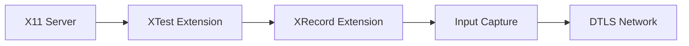
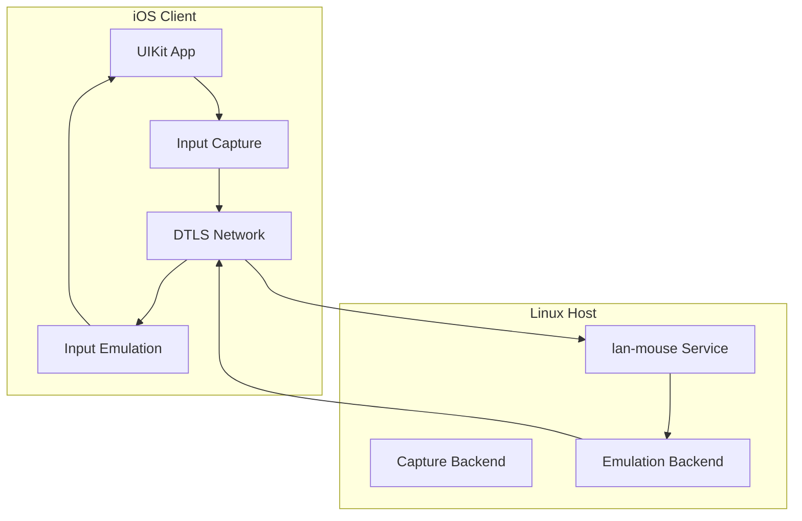
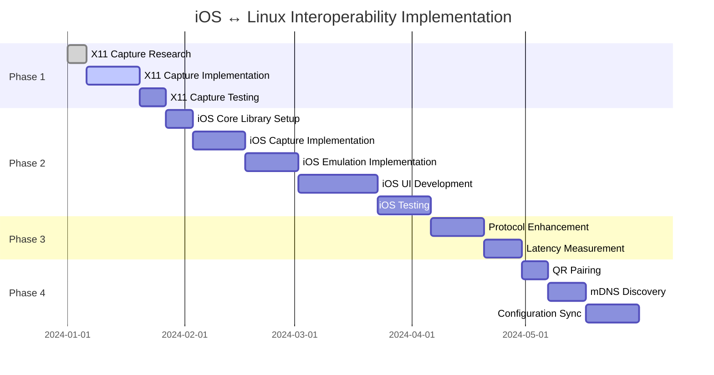

# Lan Mouse: iOS ↔ Linux (Wayland & X11) Interoperability Analysis

## Executive Summary

Lan Mouse is a cross-platform software KVM switch written in Rust that allows sharing mouse and keyboard between multiple devices. This analysis focuses on making the application work seamlessly between iOS and Linux (both Wayland and X11).

**Current Status:**
- ✅ macOS: Full support (capture + emulation)
- ✅ Linux Wayland: Good support via libei and layer-shell backends
- ✅ Linux X11: Emulation only, capture NOT implemented
- ❌ iOS: Only exists as a third-party proof-of-concept (not part of main repo)

---

## Architecture Overview

### Project Structure

```
lan-mouse/
├── input-capture/      # Cross-platform input capture library
├── input-emulation/     # Cross-platform input emulation library
├── input-event/        # Event type definitions and scancode mappings
├── lan-mouse-ipc/      # IPC communication between service and frontend
├── lan-mouse-cli/      # Command-line interface
├── lan-mouse-gtk/      # GTK4 + libadwaita frontend
├── lan-mouse-proto/    # Network protocol implementation
└── src/                # Core service logic
```

### Core Components

```mermaid
graph TB
    subgraph "Main Service"
        Service[Service]
        Capture[Capture]
        Emulation[Emulation]
        ClientManager[ClientManager]
        DnsResolver[DnsResolver]
    end
    
    subgraph "Input Capture Backends"
        LibeiCapture[libei - Wayland GNOME/KDE]
        LayerShell[layer-shell - wlroots compositors]
        MacOSCapture[macOS - CGEventTap]
        WindowsCapture[Windows - Raw Input]
        X11Capture[X11 - NOT IMPLEMENTED]
    end
    
    subgraph "Input Emulation Backends"
        LibeiEmulation[libei - Wayland GNOME/KDE]
        WlrootsEmulation[wlroots - wlroots compositors]
        XdpEmulation[xdg-desktop-portal - Wayland]
        X11Emulation[X11 - XTest]
        MacOSEmulation[macOS - CGEvent]
        WindowsEmulation[Windows - SendInput]
    end
    
    subgraph "Network Layer"
        DTLS[DTLS Encryption]
        Proto[lan-mouse-proto]
    end
    
    Service --> Capture
    Service --> Emulation
    Service --> ClientManager
    Service --> DnsResolver
    
    Capture --> LibeiCapture
    Capture --> LayerShell
    Capture --> MacOSCapture
    Capture --> WindowsCapture
    Capture --> X11Capture
    
    Emulation --> LibeiEmulation
    Emulation --> WlrootsEmulation
    Emulation --> XdpEmulation
    Emulation --> X11Emulation
    Emulation --> MacOSEmulation
    Emulation --> WindowsEmulation
    
    Service --> DTLS
    Service --> Proto
```



---

## Key Aspects of Current Architecture

### 1. Modular Backend System

The application uses a trait-based architecture for both capture and emulation:

**Capture Trait** ([`input-capture/src/lib.rs`](../input-capture/src/lib.rs:266-279)):
```rust
#[async_trait]
trait Capture: Stream<Item = Result<(Position, CaptureEvent), CaptureError>> + Unpin {
    async fn create(&mut self, pos: Position) -> Result<(), CaptureError>;
    async fn destroy(&mut self, pos: Position) -> Result<(), CaptureError>;
    async fn release(&mut self) -> Result<(), CaptureError>;
    async fn terminate(&mut self) -> Result<(), CaptureError>;
}
```

**Emulation Trait** ([`input-emulation/src/lib.rs`](../input-emulation/src/lib.rs:230-240)):
```rust
#[async_trait]
trait Emulation: Send {
    async fn consume(&mut self, event: Event, handle: EmulationHandle) -> Result<(), EmulationError>;
    async fn create(&mut self, handle: EmulationHandle);
    async fn destroy(&mut self, handle: EmulationHandle);
    async fn terminate(&mut self);
}
```

### 2. Network Protocol

The protocol ([`lan-mouse-proto/src/lib.rs`](../lan-mouse-proto/src/lib.rs)) uses:
- **DTLS encryption** via WebRTC.rs for secure communication
- **Binary protocol** with fixed-size buffers (MAX_EVENT_SIZE = 37 bytes)
- **Event types**: PointerMotion, PointerButton, PointerAxis, KeyboardKey, KeyboardModifiers, Enter, Leave, Ack, Ping, Pong

### 3. Platform Support Matrix

| Platform | Capture Backend | Emulation Backend | Status |
|----------|----------------|-------------------|--------|
| Linux Wayland (GNOME/KDE) | libei | libei, xdg-desktop-portal | ✅ Full |
| Linux Wayland (wlroots) | layer-shell | wlroots | ✅ Full |
| Linux X11 | ❌ NOT IMPLEMENTED | X11 (XTest) | ⚠️ Receive only |
| macOS | CGEventTap | CGEvent | ✅ Full |
| Windows | Raw Input | SendInput | ✅ Full |
| iOS | ❌ None | ❌ None | ❌ Not supported |

---

## Identified Bottlenecks and Issues

### Critical Issues

#### 1. X11 Input Capture Not Implemented
**File**: [`input-capture/src/x11.rs`](../input-capture/src/x11.rs)

The X11 capture backend returns `NotImplemented` error:
```rust
pub fn new() -> std::result::Result<Self, X11InputCaptureCreationError> {
    Err(X11InputCaptureCreationError::NotImplemented)
}
```

**Impact**: Linux X11 users can only receive events (emulation), not send them (capture).

#### 2. No Official iOS Support
**Reference**: [README.md line 53-56](../README.md:53-56)

iOS support exists only as a third-party proof-of-concept by rohitsangwan01:
```markdown
A proof of concept for an Android / IOS Application by [rohitsangwan01](https://github.com/rohitsangwan01/lan-mouse-mobile).
```

**Impact**: No first-class iOS client in the main repository.

### Moderate Issues

#### 3. Modifier Key Handling on wlroots
**Reference**: [README.md line 42-43](../README.md:42-43)

```
Wlroots based compositors without libei support on the receiving end currently do not handle modifier events on the client side.
This results in CTRL / SHIFT / ALT / SUPER keys not working with a sending device that is NOT using the `layer-shell` backend
```

#### 4. Wayfire Plugin Requirement
**Reference**: [README.md line 45-46](../README.md:45-46)

Wayfire requires the `shortcuts-inhibit` plugin for input capture to work.

#### 5. Keycode Translation Complexity
**Files**: 
- [`input-event/src/scancode.rs`](../input-event/src/scancode.rs) - Linux scancode mappings
- [`input-capture/src/macos.rs`](../input-capture/src/macos.rs:197-202) - macOS keycode translation

Cross-platform keycode translation is complex and error-prone:
```rust
fn map_key(ev: &CGEvent) -> Result<u32, CaptureError> {
    let code = ev.get_integer_value_field(EventField::KEYBOARD_EVENT_KEYCODE);
    match KeyMap::from_key_mapping(KeyMapping::Mac(code as u16)) {
        Ok(k) => Ok(k.evdev as u32),
        Err(()) => Err(CaptureError::KeyMapError(code)),
    }
}
```

### Minor Issues

#### 6. Network Protocol Efficiency
- Fixed-size buffers (37 bytes) may waste bandwidth
- No compression or delta encoding for pointer motion events
- Latency measurement and visualization are in roadmap but not implemented

#### 7. Configuration Management
- Configuration is file-based (TOML) with hot reload
- No distributed configuration sync between devices
- Manual fingerprint authorization required

---

## Implementation Plan for iOS ↔ Linux Interoperability

### Phase 1: X11 Input Capture Implementation (Priority: HIGH)

**Goal**: Enable Linux X11 users to send events to other devices.

**Implementation Approach**:



**Key Components**:

1. **Use XRecord Extension** for event capture:
   - XRecord allows capturing all input events globally
   - Requires X11 server with XRecord support
   - Must handle X11 permissions (XSecurity extension)

2. **Implementation Structure**:
```rust
// input-capture/src/x11.rs
pub struct X11InputCapture {
    display: *mut xlib::Display,
    record_context: xrecord::XRecordContext,
    event_tx: Sender<(Position, CaptureEvent)>,
}

impl X11InputCapture {
    pub fn new() -> Result<Self, X11InputCaptureCreationError> {
        // Open display
        // Initialize XRecord
        // Set up event mask
        // Start recording
    }
}
```

3. **Edge Detection**:
   - Monitor cursor position using `XQueryPointer`
   - Detect screen edges
   - Trigger capture when cursor crosses edge

**Files to Modify**:
- [`input-capture/src/x11.rs`](../input-capture/src/x11.rs) - Full implementation
- [`input-capture/Cargo.toml`](../input-capture/Cargo.toml) - Add xrecord dependency

**Dependencies**:
- `x11` crate with `xrecord` feature
- X11 server with XRecord extension

**Testing Strategy**:
- Unit tests for edge detection
- Integration tests with Xvfb (X Virtual Framebuffer)
- Manual testing on real X11 sessions

---

### Phase 2: iOS Client Implementation (Priority: HIGH)

**Goal**: Create a first-class iOS client that can send and receive events.

**Architecture Decisions**:



**Implementation Approach**:

#### Option A: Swift/Rust Hybrid (Recommended)
- Use Rust for protocol and event handling (reuse existing code)
- Use Swift for UI and iOS-specific APIs
- Connect via FFI (Foreign Function Interface)

**Project Structure**:
```
lan-mouse-ios/
├── LanMouse/
│   ├── App/
│   │   ├── LanMouseApp.swift
│   │   └── ContentView.swift
│   ├── Core/
│   │   ├── lan_mouse_core.h
│   │   └── lan_mouse_core.xcodeproj
│   └── Resources/
└── lan_mouse_core/  # Rust library
    ├── src/
    │   ├── lib.rs
    │   ├── ios_capture.rs
    │   ├── ios_emulation.rs
    │   └── protocol.rs
    └── Cargo.toml
```

**Key Components**:

1. **iOS Input Capture**:
```rust
// lan_mouse_core/src/ios_capture.rs
use core_graphics::event::CGEvent;
use core_foundation::runloop::CFRunLoop;

pub struct IOSInputCapture {
    event_tap: CGEventTap,
    event_tx: Sender<CaptureEvent>,
}
```

2. **iOS Input Emulation**:
```rust
// lan_mouse_core/src/ios_emulation.rs
pub struct IOSEmulation {
    event_source: CGEventSource,
}
```

3. **Network Layer**:
- Reuse existing DTLS implementation from main project
- Implement as a static/shared library for iOS

**Files to Create**:
- `lan-mouse-ios/` - New iOS project directory
- `lan-mouse-ios/lan_mouse_core/` - Rust core library
- `lan-mouse-ios/LanMouse/` - Swift UI app

**Dependencies**:
- Rust `cocoa` and `core-graphics` crates
- Swift `CryptoKit` for DTLS (or use Rust implementation)
- Swift `Network` framework

**Testing Strategy**:
- iOS Simulator testing
- Physical device testing (requires developer certificate)
- Integration testing with Linux host

---

### Phase 3: Enhanced Protocol and Performance (Priority: MEDIUM)

**Goal**: Improve protocol efficiency and add latency measurement.

**Enhancements**:

1. **Variable-Length Encoding**:
   - Use Protocol Buffers or MessagePack for more efficient encoding
   - Reduce bandwidth usage for pointer motion events

2. **Delta Encoding for Motion**:
   - Send only changes in position
   - Implement prediction algorithms

3. **Latency Measurement**:
   - Add timestamp to events
   - Calculate round-trip time
   - Display latency in UI

**Files to Modify**:
- [`lan-mouse-proto/src/lib.rs`](../lan-mouse-proto/src/lib.rs) - Protocol enhancements
- [`src/service.rs`](../src/service.rs) - Latency tracking

---

### Phase 4: Enhanced Configuration and UX (Priority: LOW)

**Goal**: Improve user experience for cross-device configuration.

**Enhancements**:

1. **QR Code Pairing**:
   - Generate QR code with connection info
   - Scan with iOS camera for easy pairing

2. **Auto-discovery**:
   - mDNS/Bonjour for device discovery
   - Zero-configuration setup

3. **Sync Configuration**:
   - Share client configurations between devices
   - Cloud sync option

**Files to Create**:
- `src/discovery.rs` - mDNS discovery
- `lan-mouse-gtk/src/qr_pairing.rs` - QR code generation

---

## Detailed Implementation Roadmap

### Task Breakdown



### Detailed Task List

#### Phase 1: X11 Input Capture

| Task | Description | Dependencies | Estimated Complexity |
|------|-------------|--------------|---------------------|
| 1.1 | Research XRecord API | None | Low |
| 1.2 | Add xrecord dependency to Cargo.toml | None | Low |
| 1.3 | Implement XRecord context initialization | 1.1, 1.2 | Medium |
| 1.4 | Implement event callback for XRecord | 1.3 | Medium |
| 1.5 | Implement edge detection logic | 1.4 | High |
| 1.6 | Implement keycode translation (X11 → Linux) | 1.4 | Medium |
| 1.7 | Add error handling for X11 permissions | 1.3 | Medium |
| 1.8 | Write unit tests | 1.5, 1.6 | Medium |
| 1.9 | Integration testing with Xvfb | 1.8 | High |
| 1.10 | Manual testing on real X11 sessions | 1.9 | Medium |

#### Phase 2: iOS Client

| Task | Description | Dependencies | Estimated Complexity |
|------|-------------|--------------|---------------------|
| 2.1 | Set up Xcode project structure | None | Low |
| 2.2 | Create Rust library for iOS | 2.1 | Medium |
| 2.3 | Implement FFI bindings between Swift and Rust | 2.2 | High |
| 2.4 | Implement iOS input capture using CGEventTap | 2.3 | Medium |
| 2.5 | Implement iOS input emulation using CGEvent | 2.3 | Medium |
| 2.6 | Port DTLS networking code to iOS | 2.2 | High |
| 2.7 | Implement Swift UI for main interface | 2.1 | Medium |
| 2.8 | Implement connection management UI | 2.7 | Medium |
| 2.9 | Implement settings UI | 2.8 | Low |
| 2.10 | Add background mode support | 2.4, 2.5 | High |
| 2.11 | iOS Simulator testing | 2.10 | Medium |
| 2.12 | Physical device testing | 2.11 | High |

#### Phase 3: Protocol & Performance

| Task | Description | Dependencies | Estimated Complexity |
|------|-------------|--------------|---------------------|
| 3.1 | Design new protocol format | None | Medium |
| 3.2 | Implement variable-length encoding | 3.1 | Medium |
| 3.3 | Implement delta encoding for motion | 3.2 | High |
| 3.4 | Add timestamp to events | 3.1 | Low |
| 3.5 | Implement latency calculation | 3.4 | Medium |
| 3.6 | Add latency display to GTK frontend | 3.5 | Low |
| 3.7 | Performance benchmarking | 3.3, 3.5 | Medium |

#### Phase 4: Configuration & UX

| Task | Description | Dependencies | Estimated Complexity |
|------|-------------|--------------|---------------------|
| 4.1 | Implement QR code generation | None | Low |
| 4.2 | Implement QR code scanning in iOS | 4.1 | Medium |
| 4.3 | Implement mDNS/Bonjour discovery | None | Medium |
| 4.4 | Add discovery to GTK frontend | 4.3 | Low |
| 4.5 | Design configuration sync protocol | 4.3 | Medium |
| 4.6 | Implement configuration sync server | 4.5 | Medium |
| 4.7 | Implement configuration sync client | 4.6 | Medium |

---

## Risk Assessment

### Technical Risks

| Risk | Impact | Probability | Mitigation |
|------|--------|-------------|------------|
| XRecord API limitations | High | Medium | Fallback to XTest polling (less efficient) |
| iOS sandbox restrictions | High | High | Use CGEventTap with proper entitlements |
| Cross-platform keycode mapping issues | Medium | High | Extensive testing and fallback tables |
| Network latency on mobile networks | Medium | Medium | Implement prediction and buffering |
| DTLS certificate management on iOS | Low | Low | Use system certificate store |

### Development Risks

| Risk | Impact | Probability | Mitigation |
|------|--------|-------------|------------|
| iOS developer certificate requirements | High | Low | Document requirements clearly |
| Rust FFI complexity | Medium | Medium | Use cbindgen for header generation |
| Testing on physical iOS devices | High | High | Prioritize simulator testing first |
| Maintaining iOS app alongside Rust code | Medium | Medium | CI/CD with automated builds |

---

## Success Criteria

### Phase 1 Success Criteria
- ✅ X11 users can capture and send events to other devices
- ✅ Edge detection works reliably
- ✅ All keycodes translate correctly
- ✅ Performance is comparable to other backends

### Phase 2 Success Criteria
- ✅ iOS app can discover and connect to Linux hosts
- ✅ iOS app can send mouse and keyboard events
- ✅ iOS app can receive and emulate events
- ✅ Background mode works correctly
- ✅ App is available on App Store (or TestFlight)

### Phase 3 Success Criteria
- ✅ Protocol bandwidth usage reduced by 30%+
- ✅ Latency is measured and displayed
- ✅ Latency is under 20ms on local network

### Phase 4 Success Criteria
- ✅ QR code pairing works end-to-end
- ✅ mDNS discovery finds devices on local network
- ✅ Configuration syncs between devices

---

## Conclusion

The Lan Mouse architecture is well-designed with a modular backend system that makes adding new platforms relatively straightforward. The main gaps for iOS ↔ Linux interoperability are:

1. **X11 input capture** - Critical for Linux X11 users
2. **Official iOS client** - Essential for mobile users
3. **Protocol optimizations** - Important for performance on mobile networks

The implementation plan prioritizes these gaps in a logical order, with X11 capture being the quickest win (can be done entirely in Rust), followed by the iOS client (requires new Swift code), and finally protocol and UX enhancements.

The modular architecture means that each phase can be developed and tested independently, reducing risk and allowing for incremental delivery.
