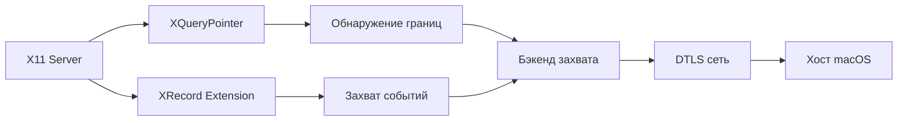
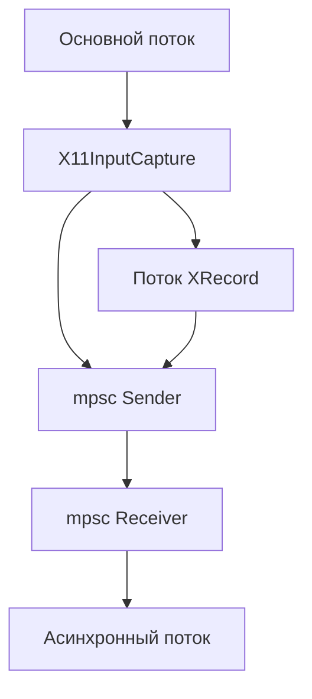
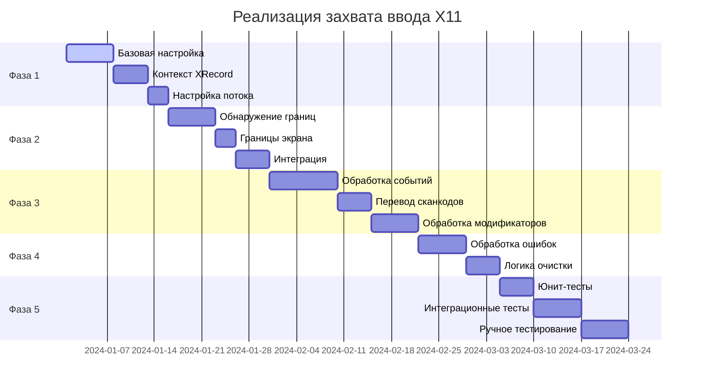

# Lan Mouse: План совместимости macOS ↔ Linux (Wayland & X11)

## Краткое резюме

Lan Mouse — это кроссплатформенный программный KVM-переключатель, написанный на Rust, который позволяет использовать одну мышь и клавиатуру на нескольких устройствах. Этот план фокусируется на обеспечении бесшовной совместимости между **macOS и Linux** (как на Wayland, так и на X11).

**Текущий статус:**
- ✅ macOS: Полная поддержка (захват + эмуляция) с использованием CGEventTap/CGEvent
- ✅ Linux Wayland: Полная поддержка через бэкенды libei и layer-shell
- ⚠️ Linux X11: Только эмуляция (XTest), захват НЕ реализован
- ❌ iOS: Не входит в область действия этого плана

**Основная цель:**
Реализовать бэкенд захвата ввода X11, чтобы пользователи Linux X11 могли отправлять события на macOS и другие устройства.

---

## Обзор архитектуры

### Структура проекта

```
lan-mouse/
├── input-capture/      # Библиотека захвата ввода для разных платформ
│   ├── src/
│   │   ├── lib.rs      # Основной трейт захвата и выбор бэкенда
│   │   ├── libei.rs    # Бэкенд libei для Wayland (GNOME/KDE)
│   │   ├── layer_shell.rs  # Бэкенд layer-shell для wlroots
│   │   ├── macos.rs    # Бэкенд macOS CGEventTap ✅
│   │   ├── windows.rs  # Бэкенд Windows Raw Input
│   │   └── x11.rs      # Бэкенд X11 - НЕ РЕАЛИЗОВАН ❌
├── input-emulation/     # Библиотека эмуляции ввода для разных платформ
│   ├── src/
│   │   ├── lib.rs      # Основной трейт эмуляции и выбор бэкенда
│   │   ├── libei.rs    # Бэкенд libei для Wayland
│   │   ├── wlroots.rs  # wlroots virtual-pointer/keyboard
│   │   ├── xdg_desktop_portal.rs  # XDG Desktop Portal
│   │   ├── x11.rs      # Бэкенд X11 XTest ✅
│   │   ├── macos.rs    # Бэкенд macOS CGEvent ✅
│   │   └── windows.rs  # Бэкенд Windows SendInput
├── input-event/        # Определения типов событий и маппинг сканкодов
├── lan-mouse-ipc/      # IPC-коммуникация
├── lan-mouse-proto/    # Сетевой протокол (DTLS)
└── src/                # Основная логика сервиса
```

### Матрица поддержки платформ

| Платформа | Бэкенд захвата | Бэкенд эмуляции | Статус |
|----------|----------------|-------------------|--------|
| macOS | CGEventTap | CGEvent | ✅ Полный |
| Linux Wayland (GNOME/KDE) | libei | libei, xdg-desktop-portal | ✅ Полный |
| Linux Wayland (wlroots) | layer-shell | wlroots | ✅ Полный |
| Linux X11 | ❌ НЕ РЕАЛИЗОВАН | X11 (XTest) | ⚠️ Только приём |

---

## Текущие реализации бэкендов

### Бэкенд захвата macOS (Референс)

Бэкенд macOS использует [`CGEventTap`](../input-capture/src/macos.rs) для глобального перехвата событий:

```rust
pub struct MacOSInputCapture {
    event_tap: CGEventTap,
    event_tx: Sender<(Position, CaptureEvent)>,
    // ... управление состоянием
}
```

**Ключевые особенности:**
- Использует `CGEventTap` для глобального перехвата событий
- Мониторит позицию курсора для обнаружения пересечения границ экрана
- Переводит коды клавиш macOS в сканкоды Linux
- Отслеживает состояние модификаторных клавиш

### Бэкенд эмуляции X11 (Работает)

Бэкенд эмуляции X11 использует [`XTest`](../input-emulation/src/x11.rs) для инъекции событий:

```rust
pub struct X11Emulation {
    display: *mut xlib::Display,
}
```

**Ключевые особенности:**
- Использует `XTestFakeMotionEvent` для движения указателя
- Использует `XTestFakeButtonEvent` для кнопок мыши
- Использует `XTestFakeKeyEvent` для клавиатурных событий
- Смещение кода клавиши: `key + 8` (код клавиши Xorg смещён на 8)

### Бэкенд захвата X11 (НЕ РЕАЛИЗОВАН)

Бэкенд захвата X11 в [`input-capture/src/x11.rs`](../input-capture/src/x11.rs) является заглушкой:

```rust
pub struct X11InputCapture {}

impl X11InputCapture {
    pub fn new() -> std::result::Result<Self, X11InputCaptureCreationError> {
        Err(X11InputCaptureCreationError::NotImplemented)
    }
}
```

---

## План реализации: Захват ввода X11

### Архитектура



### Технический подход

#### 1. Расширение XRecord для захвата событий

Расширение XRecord позволяет захватывать все события ввода глобально:

**Настройка контекста XRecord:**
```rust
use x11::{xlib, xrecord};

pub struct X11InputCapture {
    display: *mut xlib::Display,
    record_display: *mut xlib::Display,
    record_context: xrecord::XRecordContext,
    event_tx: Sender<(Position, CaptureEvent)>,
    // ... управление состоянием
}
```

**Ключевые функции XRecord:**
- `XRecordQueryVersion` - Проверка доступности XRecord
- `XRecordAllocRange` - Выделение диапазона записи
- `XRecordCreateContext` - Создание контекста записи
- `XRecordEnableContext` - Запуск записи
- `XRecordDisableContext` - Остановка записи

#### 2. Обнаружение границ с XQueryPointer

Мониторинг позиции курсора для обнаружения пересечения границ экрана:

```rust
fn check_edge_crossing(&self, current_pos: (i32, i32)) -> Option<Position> {
    let screen_width = unsafe { xlib::XDisplayWidth(self.display, 0) };
    let screen_height = unsafe { xlib::XDisplayHeight(self.display, 0) };
    
    for &position in self.active_clients.iter() {
        match position {
            Position::Left if current_pos.0 <= 0 => return Some(Position::Left),
            Position::Right if current_pos.0 >= screen_width - 1 => return Some(Position::Right),
            Position::Top if current_pos.1 <= 0 => return Some(Position::Top),
            Position::Bottom if current_pos.1 >= screen_height - 1 => return Some(Position::Bottom),
            _ => {}
        }
    }
    None
}
```

#### 3. Перевод кода клавиши X11 в сканкод Linux

Коды клавиш X11 нужно перевести в сканкоды Linux:

```rust
fn x11_keycode_to_linux_scancode(x11_keycode: u8) -> u32 {
    // Коды клавиш X11 уже смещены на 8 в эмуляции XTest
    // Для захвата нужно выполнить обратное преобразование
    (x11_keycode as u32) - 8
}
```

#### 4. Архитектура потоков

Использование отдельного потока для обработки событий XRecord:



### Задачи реализации

#### Фаза 1: Базовая настройка захвата X11

| Задача | Описание | Зависимости | Сложность |
|------|-------------|--------------|------------|
| 1.1 | Добавить функцию xrecord в зависимость x11 | Нет | Низкая |
| 1.2 | Реализовать подключение к дисплею X11 | Нет | Низкая |
| 1.3 | Реализовать инициализацию контекста XRecord | 1.1, 1.2 | Средняя |
| 1.4 | Реализовать колбэк XRecord для захвата событий | 1.3 | Средняя |
| 1.5 | Настроить поток для обработки событий XRecord | 1.4 | Средняя |
| 1.6 | Реализовать канал mpsc для коммуникации событий | 1.5 | Низкая |

#### Фаза 2: Обнаружение границ

| Задача | Описание | Зависимости | Сложность |
|------|-------------|--------------|------------|
| 2.1 | Реализовать XQueryPointer для позиции курсора | Нет | Низкая |
| 2.2 | Реализовать обнаружение границ экрана | 2.1 | Низкая |
| 2.3 | Реализовать логику пересечения границ | 2.1, 2.2 | Средняя |
| 2.4 | Реализовать периодический опрос позиции курсора | 2.3 | Средняя |
| 2.5 | Интегрировать обнаружение границ с состоянием захвата | 2.4 | Высокая |

#### Фаза 3: Обработка событий

| Задача | Описание | Зависимости | Сложность |
|------|-------------|--------------|------------|
| 3.1 | Реализовать перевод кода клавиши X11 в сканкод Linux | Нет | Средняя |
| 3.2 | Обработка событий движения указателя | 3.1 | Низкая |
| 3.3 | Обработка событий кнопок мыши | 3.1 | Низкая |
| 3.4 | Обработка клавиатурных событий | 3.1 | Средняя |
| 3.5 | Обработка событий прокрутки | 3.1 | Средняя |
| 3.6 | Обработка состояния модификаторных клавиш | 3.5 | Высокая |

#### Фаза 4: Обработка ошибок и очистка

| Задача | Описание | Зависимости | Сложность |
|------|-------------|--------------|------------|
| 4.1 | Реализовать обработку ошибок дисплея X11 | Нет | Средняя |
| 4.2 | Реализовать обработку ошибок XRecord | 4.1 | Средняя |
| 4.3 | Реализовать правильную очистку при уничтожении | 4.2 | Средняя |
| 4.4 | Обработка перезапуска контекста XRecord при ошибке | 4.3 | Высокая |

#### Фаза 5: Тестирование

| Задача | Описание | Зависимости | Сложность |
|------|-------------|--------------|------------|
| 5.1 | Юнит-тесты для обнаружения границ | 2.5 | Средняя |
| 5.2 | Юнит-тесты для перевода кодов клавиш | 3.1 | Низкая |
| 5.3 | Интеграционное тестирование с Xvfb | Все фазы | Высокая |
| 5.4 | Ручное тестирование на реальных сессиях X11 | 5.3 | Средняя |
| 5.5 | Кроссплатформенное тестирование (Linux X11 ↔ macOS) | 5.4 | Высокая |

---

## Модификация файлов

### 1. input-capture/Cargo.toml

Добавить функцию `xrecord` в зависимость x11:

```toml
[target.'cfg(all(unix, not(target_os="macos")))'.dependencies]
x11 = { version = "2.21.0", features = ["xlib", "xtest", "xrecord"], optional = true }
```

### 2. input-capture/src/x11.rs

Полная реализация X11InputCapture:

```rust
use std::{
    ptr,
    sync::Arc,
    task::{Context, Poll},
    thread,
};

use async_trait::async_trait;
use futures_core::Stream;
use tokio::sync::{mpsc, Mutex};
use x11::{
    xlib::{self, XCloseDisplay, XDisplayWidth, XDisplayHeight},
    xrecord::{self, XRecordClientInfo, XRecordInterceptData},
};

use input_event::{Event, KeyboardEvent, PointerEvent, scancode};

use super::{Capture, CaptureError, CaptureEvent, Position, error::X11InputCaptureCreationError};

pub struct X11InputCapture {
    display: *mut xlib::Display,
    record_display: *mut xlib::Display,
    record_context: xrecord::XRecordContext,
    event_rx: mpsc::Receiver<Result<(Position, CaptureEvent), CaptureError>>,
    active_clients: Arc<Mutex<HashSet<Position>>>,
    // ... дополнительное состояние
}
```

### 3. input-capture/src/error.rs

Обновить типы ошибок для захвата X11:

```rust
#[derive(Debug, thiserror::Error)]
pub enum X11InputCaptureCreationError {
    #[error("Захват ввода X11 не реализован")]
    NotImplemented,
    #[error("Не удалось открыть дисплей X11")]
    OpenDisplay,
    #[error("Расширение XRecord недоступно")]
    XRecordNotAvailable,
    #[error("Не удалось создать контекст XRecord")]
    XRecordContext,
    // ... дополнительные варианты ошибок
}
```

---

## Соображения по совместимости

### Совместимость macOS ↔ Linux

Сетевой протокол ([`lan-mouse-proto`](../lan-mouse-proto/src/lib.rs)) не зависит от платформы:

- **DTLS шифрование** обеспечивает защищённую коммуникацию
- **Типы событий** стандартизированы (PointerMotion, PointerButton, KeyboardKey и т.д.)
- **Маппинг сканкодов** обрабатывается каждым бэкендом захвата/эмуляции

**Ключевые точки совместимости:**

1. **Перевод сканкодов:**
   - Захват macOS: код клавиши macOS → сканкод Linux (уже реализовано)
   - Захват Linux X11: код клавиши X11 → сканкод Linux (будет реализовано)
   - Эмуляция macOS: сканкод Linux → код клавиши macOS (уже реализовано)
   - Эмуляция Linux X11: сканкод Linux → код клавиши X11 (уже реализовано)

2. **События указателя:**
   - Все платформы используют относительные координаты для движения указателя
   - Маппинг кнопок стандартизирован (BTN_LEFT, BTN_RIGHT и т.д.)

3. **Модификаторные клавиши:**
   - Каждый бэкенд отслеживает своё состояние модификаторов
   - Модификаторы отправляются как отдельные события KeyboardModifiers

### Известные проблемы и ограничения

1. **Разрешения XRecord:**
   - XRecord может требовать определённые конфигурации безопасности X11
   - Некоторые серверы X11 могут отключать XRecord по умолчанию

2. **Поддержка нескольких мониторов:**
   - Обнаружение границ должно учитывать несколько экранов X11
   - Расчёт границ экрана должен обрабатывать Xinerama/XRandR

3. **Маппинг кодов клавиш:**
   - Коды клавиш X11 могут различаться между разными раскладками клавиатуры
   - Некоторые специальные клавиши могут не иметь прямых маппингов

4. **Производительность:**
   - Колбэк XRecord выполняется в отдельном потоке
   - Накладные расходы на обработку событий могут влиять на задержку

---

## Стратегия тестирования

### Юнит-тестирование

```rust
#[cfg(test)]
mod tests {
    use super::*;

    #[test]
    fn test_x11_keycode_to_linux_scancode() {
        assert_eq!(x11_keycode_to_linux_scancode(24), 16); // клавиша 'q'
        // ... больше тестов
    }

    #[test]
    fn test_edge_detection() {
        // Тест логики пересечения границ
    }
}
```

### Интеграционное тестирование с Xvfb

```bash
# Запуск Xvfb для тестирования
Xvfb :99 -screen 0 1920x1080x24 &
export DISPLAY=:99

# Запуск тестов
cargo test --package input-capture --features x11
```

### Чеклист ручного тестирования

- [ ] Захват событий движения мыши
- [ ] Захват событий кнопок мыши (левая, правая, средняя)
- [ ] Захват событий прокрутки (вверх, вниз, влево, вправо)
- [ ] Захват клавиатурных событий (буквы, цифры, символы)
- [ ] Захват модификаторных клавиш (Ctrl, Shift, Alt, Super)
- [ ] Обнаружение границ работает на всех четырёх сторонах
- [ ] События корректно отправляются на хост macOS
- [ ] Повтор клавиш обрабатывается корректно
- [ ] Состояние модификаторов поддерживается при захвате/освобождении
- [ ] Очистка работает корректно при уничтожении

---

## Временная шкала реализации



---

## Критерии успеха

Реализация будет считаться успешной, когда:

1. ✅ Бэкенд захвата ввода X11 полностью функционален
2. ✅ Пользователи Linux X11 могут отправлять события на хосты macOS
3. ✅ Пользователи Linux X11 могут отправлять события на хосты Linux Wayland
4. ✅ Все типы событий захватываются корректно (движение, кнопки, клавиатура, прокрутка)
5. ✅ Обнаружение границ работает надёжно на всех границах экрана
6. ✅ Состояние модификаторных клавиш поддерживается корректно
7. ✅ Очистка работает правильно без утечек памяти
8. ✅ Тесты проходят (юнит + интеграционные + ручные)

---

## Будущие улучшения

После завершения захвата X11, рассмотрите эти улучшения:

1. **Поддержка нескольких мониторов:**
   - Обнаружение и обработка нескольких экранов X11
   - Поддержка Xinerama/XRandR для правильного обнаружения границ

2. **Оптимизация производительности:**
   - Реализация пакетирования событий для движения указателя
   - Добавление дельта-кодирования для событий движения

3. **Улучшенное восстановление после ошибок:**
   - Автоматический перезапуск контекста XRecord при ошибке
   - Graceful degradation, когда XRecord недоступен

4. **Опции конфигурации:**
   - Настраиваемый порог обнаружения границ
   - Опциональная фильтрация событий (например, игнорирование определённых клавиш)

5. **Измерение задержки:**
   - Добавление временной метки к событиям
   - Расчёт и отображение времени полного цикла

---

## Ссылки

- [Спецификация протокола X11](https://www.x.org/releases/X11R7.7/doc/xproto/xproto.html)
- [Расширение XRecord](https://www.x.org/docs/Xext/recordproto.pdf)
- [Расширение XTest](https://www.x.org/docs/Xext/xtestproto.pdf)
- [Документация крейта x11-rs](https://docs.rs/x11/latest/x11/)
- [Документация CGEventTap для macOS](https://developer.apple.com/documentation/coregraphics/cgeventtap)
- [Сканкоды Linux evdev](https://github.com/torvalds/linux/blob/master/include/uapi/linux/input-event-codes.h)
