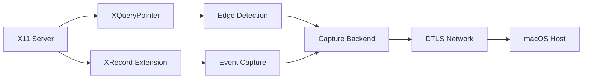
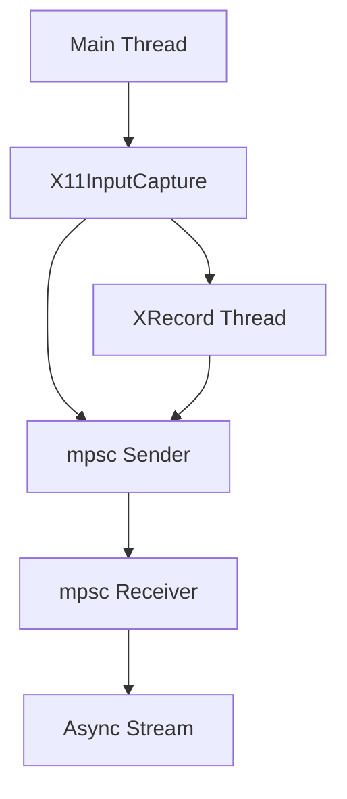
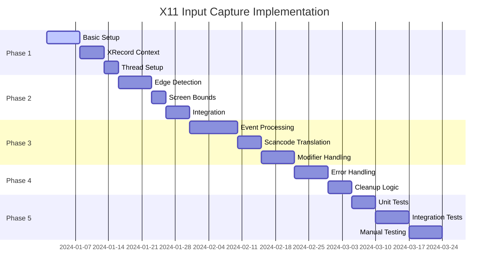

# Lan Mouse: macOS ↔ Linux (Wayland & X11) Interoperability Plan

## Executive Summary

Lan Mouse is a cross-platform software KVM switch written in Rust that allows sharing mouse and keyboard between multiple devices. This plan focuses on ensuring seamless compatibility between **macOS and Linux** (both Wayland and X11).

**Current Status:**
- ✅ macOS: Full support (capture + emulation) using CGEventTap/CGEvent
- ✅ Linux Wayland: Full support via libei and layer-shell backends
- ⚠️ Linux X11: Emulation only (XTest), capture NOT implemented
- ❌ iOS: Not in scope for this plan

**Primary Goal:**
Implement X11 input capture backend to enable Linux X11 users to send events to macOS and other devices.

---

## Architecture Overview

### Project Structure

```
lan-mouse/
├── input-capture/      # Cross-platform input capture library
│   ├── src/
│   │   ├── lib.rs      # Main capture trait and backend selection
│   │   ├── libei.rs    # libei backend for Wayland (GNOME/KDE)
│   │   ├── layer_shell.rs  # layer-shell backend for wlroots
│   │   ├── macos.rs    # macOS CGEventTap backend ✅
│   │   ├── windows.rs  # Windows Raw Input backend
│   │   └── x11.rs      # X11 backend - NOT IMPLEMENTED ❌
├── input-emulation/     # Cross-platform input emulation library
│   ├── src/
│   │   ├── lib.rs      # Main emulation trait and backend selection
│   │   ├── libei.rs    # libei backend for Wayland
│   │   ├── wlroots.rs  # wlroots virtual-pointer/keyboard
│   │   ├── xdg_desktop_portal.rs  # XDG Desktop Portal
│   │   ├── x11.rs      # X11 XTest backend ✅
│   │   ├── macos.rs    # macOS CGEvent backend ✅
│   │   └── windows.rs  # Windows SendInput backend
├── input-event/        # Event type definitions and scancode mappings
├── lan-mouse-ipc/      # IPC communication
├── lan-mouse-proto/    # Network protocol (DTLS)
└── src/                # Core service logic
```

### Platform Support Matrix

| Platform | Capture Backend | Emulation Backend | Status |
|----------|----------------|-------------------|--------|
| macOS | CGEventTap | CGEvent | ✅ Full |
| Linux Wayland (GNOME/KDE) | libei | libei, xdg-desktop-portal | ✅ Full |
| Linux Wayland (wlroots) | layer-shell | wlroots | ✅ Full |
| Linux X11 | ❌ NOT IMPLEMENTED | X11 (XTest) | ⚠️ Receive only |

---

## Current Backend Implementations

### macOS Capture Backend (Reference)

The macOS backend uses [`CGEventTap`](../input-capture/src/macos.rs) for global event capture:

```rust
pub struct MacOSInputCapture {
    event_tap: CGEventTap,
    event_tx: Sender<(Position, CaptureEvent)>,
    // ... state management
}
```

**Key features:**
- Uses `CGEventTap` for global event interception
- Monitors cursor position to detect screen edge crossing
- Translates macOS keycodes to Linux scancodes
- Handles modifier key state tracking

### X11 Emulation Backend (Working)

The X11 emulation backend uses [`XTest`](../input-emulation/src/x11.rs) for event injection:

```rust
pub struct X11Emulation {
    display: *mut xlib::Display,
}
```

**Key features:**
- Uses `XTestFakeMotionEvent` for pointer movement
- Uses `XTestFakeButtonEvent` for mouse buttons
- Uses `XTestFakeKeyEvent` for keyboard events
- Keycode offset: `key + 8` (Xorg keycodes are shifted by 8)

### X11 Capture Backend (NOT IMPLEMENTED)

The X11 capture backend in [`input-capture/src/x11.rs`](../input-capture/src/x11.rs) is a stub:

```rust
pub struct X11InputCapture {}

impl X11InputCapture {
    pub fn new() -> std::result::Result<Self, X11InputCaptureCreationError> {
        Err(X11InputCaptureCreationError::NotImplemented)
    }
}
```

---

## Implementation Plan: X11 Input Capture

### Architecture



### Technical Approach

#### 1. XRecord Extension for Event Capture

The XRecord extension allows capturing all input events globally:

**XRecord Context Setup:**
```rust
use x11::{xlib, xrecord};

pub struct X11InputCapture {
    display: *mut xlib::Display,
    record_display: *mut xlib::Display,
    record_context: xrecord::XRecordContext,
    event_tx: Sender<(Position, CaptureEvent)>,
    // ... state management
}
```

**Key XRecord Functions:**
- `XRecordQueryVersion` - Check XRecord availability
- `XRecordAllocRange` - Allocate recording range
- `XRecordCreateContext` - Create recording context
- `XRecordEnableContext` - Start recording
- `XRecordDisableContext` - Stop recording

#### 2. Edge Detection with XQueryPointer

Monitor cursor position to detect screen edge crossing:

```rust
fn check_edge_crossing(&self, current_pos: (i32, i32)) -> Option<Position> {
    let screen_width = unsafe { xlib::XDisplayWidth(self.display, 0) };
    let screen_height = unsafe { xlib::XDisplayHeight(self.display, 0) };
    
    for &position in self.active_clients.iter() {
        match position {
            Position::Left if current_pos.0 <= 0 => return Some(Position::Left),
            Position::Right if current_pos.0 >= screen_width - 1 => return Some(Position::Right),
            Position::Top if current_pos.1 <= 0 => return Some(Position::Top),
            Position::Bottom if current_pos.1 >= screen_height - 1 => return Some(Position::Bottom),
            _ => {}
        }
    }
    None
}
```

#### 3. X11 to Linux Scancode Translation

X11 keycodes need to be translated to Linux scancodes:

```rust
fn x11_keycode_to_linux_scancode(x11_keycode: u8) -> u32 {
    // X11 keycodes are already shifted by 8 in XTest emulation
    // For capture, we need to reverse this
    (x11_keycode as u32) - 8
}
```

#### 4. Thread Architecture

Use a dedicated thread for XRecord event processing:



### Implementation Tasks

#### Phase 1: Basic X11 Capture Setup

| Task | Description | Dependencies | Complexity |
|------|-------------|--------------|------------|
| 1.1 | Add xrecord feature to x11 dependency | None | Low |
| 1.2 | Implement X11 display connection | None | Low |
| 1.3 | Implement XRecord context initialization | 1.1, 1.2 | Medium |
| 1.4 | Implement XRecord callback for event capture | 1.3 | Medium |
| 1.5 | Set up thread for XRecord event processing | 1.4 | Medium |
| 1.6 | Implement mpsc channel for event communication | 1.5 | Low |

#### Phase 2: Edge Detection

| Task | Description | Dependencies | Complexity |
|------|-------------|--------------|------------|
| 2.1 | Implement XQueryPointer for cursor position | None | Low |
| 2.2 | Implement screen bounds detection | 2.1 | Low |
| 2.3 | Implement edge crossing logic | 2.1, 2.2 | Medium |
| 2.4 | Implement periodic cursor position polling | 2.3 | Medium |
| 2.5 | Integrate edge detection with capture state | 2.4 | High |

#### Phase 3: Event Processing

| Task | Description | Dependencies | Complexity |
|------|-------------|--------------|------------|
| 3.1 | Implement X11 keycode to Linux scancode translation | None | Medium |
| 3.2 | Process pointer motion events | 3.1 | Low |
| 3.3 | Process mouse button events | 3.1 | Low |
| 3.4 | Process keyboard events | 3.1 | Medium |
| 3.5 | Process scroll events | 3.1 | Medium |
| 3.6 | Handle modifier key state | 3.5 | High |

#### Phase 4: Error Handling and Cleanup

| Task | Description | Dependencies | Complexity |
|------|-------------|--------------|------------|
| 4.1 | Implement X11 display error handling | None | Medium |
| 4.2 | Implement XRecord error handling | 4.1 | Medium |
| 4.3 | Implement proper cleanup on destroy | 4.2 | Medium |
| 4.4 | Handle XRecord context restart on error | 4.3 | High |

#### Phase 5: Testing

| Task | Description | Dependencies | Complexity |
|------|-------------|--------------|------------|
| 5.1 | Unit tests for edge detection | 2.5 | Medium |
| 5.2 | Unit tests for keycode translation | 3.1 | Low |
| 5.3 | Integration testing with Xvfb | All phases | High |
| 5.4 | Manual testing on real X11 sessions | 5.3 | Medium |
| 5.5 | Cross-platform testing (Linux X11 ↔ macOS) | 5.4 | High |

---

## File Modifications

### 1. input-capture/Cargo.toml

Add `xrecord` feature to x11 dependency:

```toml
[target.'cfg(all(unix, not(target_os="macos")))'.dependencies]
x11 = { version = "2.21.0", features = ["xlib", "xtest", "xrecord"], optional = true }
```

### 2. input-capture/src/x11.rs

Complete implementation of X11InputCapture:

```rust
use std::{
    ptr,
    sync::Arc,
    task::{Context, Poll},
    thread,
};

use async_trait::async_trait;
use futures_core::Stream;
use tokio::sync::{mpsc, Mutex};
use x11::{
    xlib::{self, XCloseDisplay, XDisplayWidth, XDisplayHeight},
    xrecord::{self, XRecordClientInfo, XRecordInterceptData},
};

use input_event::{Event, KeyboardEvent, PointerEvent, scancode};

use super::{Capture, CaptureError, CaptureEvent, Position, error::X11InputCaptureCreationError};

pub struct X11InputCapture {
    display: *mut xlib::Display,
    record_display: *mut xlib::Display,
    record_context: xrecord::XRecordContext,
    event_rx: mpsc::Receiver<Result<(Position, CaptureEvent), CaptureError>>,
    active_clients: Arc<Mutex<HashSet<Position>>>,
    // ... additional state
}
```

### 3. input-capture/src/error.rs

Update error types for X11 capture:

```rust
#[derive(Debug, thiserror::Error)]
pub enum X11InputCaptureCreationError {
    #[error("X11 input capture is not implemented")]
    NotImplemented,
    #[error("Failed to open X11 display")]
    OpenDisplay,
    #[error("XRecord extension not available")]
    XRecordNotAvailable,
    #[error("Failed to create XRecord context")]
    XRecordContext,
    // ... additional error variants
}
```

---

## Compatibility Considerations

### macOS ↔ Linux Compatibility

The network protocol ([`lan-mouse-proto`](../lan-mouse-proto/src/lib.rs)) is platform-agnostic:

- **DTLS encryption** ensures secure communication
- **Event types** are standardized (PointerMotion, PointerButton, KeyboardKey, etc.)
- **Scancode mappings** are handled by each platform's capture/emulation backend

**Key compatibility points:**

1. **Scancode Translation:**
   - macOS capture: macOS keycode → Linux scancode (already implemented)
   - Linux X11 capture: X11 keycode → Linux scancode (to be implemented)
   - macOS emulation: Linux scancode → macOS keycode (already implemented)
   - Linux X11 emulation: Linux scancode → X11 keycode (already implemented)

2. **Pointer Events:**
   - All platforms use relative coordinates for pointer motion
   - Button mappings are standardized (BTN_LEFT, BTN_RIGHT, etc.)

3. **Modifier Keys:**
   - Each backend tracks its own modifier state
   - Modifiers are sent as separate KeyboardModifiers events

### Known Issues and Limitations

1. **XRecord Permissions:**
   - XRecord may require specific X11 security configurations
   - Some X11 servers may disable XRecord by default

2. **Multi-Monitor Support:**
   - Edge detection needs to account for multiple X11 screens
   - Screen bounds calculation must handle Xinerama/XRandR

3. **Keycode Mapping:**
   - X11 keycodes may vary between different keyboard layouts
   - Some special keys may not have direct mappings

4. **Performance:**
   - XRecord callback runs in a separate thread
   - Event processing overhead may affect latency

---

## Testing Strategy

### Unit Testing

```rust
#[cfg(test)]
mod tests {
    use super::*;

    #[test]
    fn test_x11_keycode_to_linux_scancode() {
        assert_eq!(x11_keycode_to_linux_scancode(24), 16); // 'q' key
        // ... more tests
    }

    #[test]
    fn test_edge_detection() {
        // Test edge crossing logic
    }
}
```

### Integration Testing with Xvfb

```bash
# Start Xvfb for testing
Xvfb :99 -screen 0 1920x1080x24 &
export DISPLAY=:99

# Run tests
cargo test --package input-capture --features x11
```

### Manual Testing Checklist

- [ ] Capture mouse motion events
- [ ] Capture mouse button events (left, right, middle)
- [ ] Capture scroll events (up, down, left, right)
- [ ] Capture keyboard events (letters, numbers, symbols)
- [ ] Capture modifier keys (Ctrl, Shift, Alt, Super)
- [ ] Edge detection works on all four sides
- [ ] Events are correctly sent to macOS host
- [ ] Key repeat is handled correctly
- [ ] Modifier state is maintained across capture/release
- [ ] Cleanup works correctly on destroy

---

## Implementation Timeline



---

## Success Criteria

The implementation will be considered successful when:

1. ✅ X11 input capture backend is fully functional
2. ✅ Linux X11 users can send events to macOS hosts
3. ✅ Linux X11 users can send events to Linux Wayland hosts
4. ✅ All event types are captured correctly (motion, buttons, keyboard, scroll)
5. ✅ Edge detection works reliably on all screen edges
6. ✅ Modifier key state is maintained correctly
7. ✅ Cleanup works properly without memory leaks
8. ✅ Tests pass (unit + integration + manual)

---

## Future Enhancements

After completing X11 capture, consider these improvements:

1. **Multi-Monitor Support:**
   - Detect and handle multiple X11 screens
   - Support Xinerama/XRandR for proper edge detection

2. **Performance Optimization:**
   - Implement event batching for pointer motion
   - Add delta encoding for motion events

3. **Enhanced Error Recovery:**
   - Automatic XRecord context restart on error
   - Graceful degradation when XRecord is unavailable

4. **Configuration Options:**
   - Configurable edge detection threshold
   - Optional event filtering (e.g., ignore specific keys)

5. **Latency Measurement:**
   - Add timestamp to events
   - Calculate and display round-trip time

---

## References

- [X11 Protocol Specification](https://www.x.org/releases/X11R7.7/doc/xproto/xproto.html)
- [XRecord Extension](https://www.x.org/docs/Xext/recordproto.pdf)
- [XTest Extension](https://www.x.org/docs/Xext/xtestproto.pdf)
- [x11-rs crate documentation](https://docs.rs/x11/latest/x11/)
- [macOS CGEventTap documentation](https://developer.apple.com/documentation/coregraphics/cgeventtap)
- [Linux evdev scancodes](https://github.com/torvalds/linux/blob/master/include/uapi/linux/input-event-codes.h)
